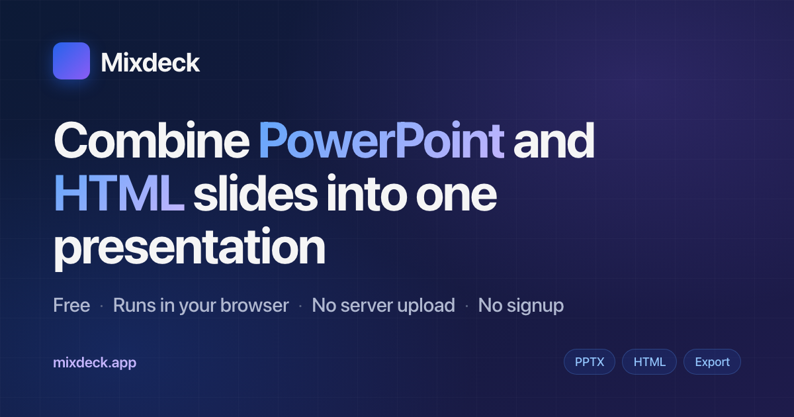

# Mixdeck

Free in-browser tool that combines HTML and PowerPoint slide decks into one presentation. Mix slides from multiple sources, reorder visually, present, and export as a self-contained HTML file.

**Live:** [https://mixdeck.app](https://mixdeck.app)



## What it does

- **Mix HTML and PowerPoint.** Drop `.html` or `.pptx` files; both land on one timeline you can reorder freely.
- **Native HTML playback.** HTML decks load with their original CSS and JS intact — animations replay natively when slides run in their source order. PowerPoint slides come through as static layouts.
- **Export as one file.** Download a single self-contained HTML file. Recipients open it like any other web page — no app needed.
- **Private by default.** No upload, no signup, no cookies, no individual tracking. Files never leave your device. Hosted on Cloudflare; aggregate page-view counts and anonymous usage counters (e.g. *"a file was imported today"*) are stored so I can see if the tool is useful. No identifiers, no IPs retained, no fingerprinting.

## Quick start

Just open [mixdeck.app](https://mixdeck.app) and drag your deck files in.

To run locally:

```sh
git clone https://github.com/alexander-axelsen/mixdeck.git
cd mixdeck
# open index.html in your browser, or serve via any static server
```

Opening `index.html` directly works for HTML decks. For `.pptx` import, you need to serve via a static server (browsers block dynamic `import()` over `file://`) — anything works: `python3 -m http.server`, `npx serve`, `caddy file-server`, the IDE's built-in preview, whatever you have.

No build step. Vanilla HTML + CSS + JS. The only dependency is `lib/pptx.js`, vendored.

## Making your own Mixdeck-compatible HTML deck

Each slide is a top-level `<section class="slide">` inside `<body>`, hidden by default, shown via `.active`. The deck includes a small navigation script that reads `window.STARTING_SLIDE` and listens for arrow keys.

Full spec + starter template + AI prompt (paste into Claude/ChatGPT to convert your existing deck): see the **"Make your HTML deck Mixdeck-ready"** section on the splash at [mixdeck.app](https://mixdeck.app).

## Known limitations

- PPTX animations, transitions, embedded video/audio, and most custom effects don't transfer — slides become static layouts.
- PowerPoint conversion is approximate (fonts may substitute; complex shapes/charts may render imperfectly).
- HTML decks must follow the format spec — Reveal.js / Google Slides / Keynote exports need conversion (the splash has an AI prompt for that).
- No undo / no autosave across tab close — use **Export** before closing if you want to keep your work.
- Reordering can break deck-internal JS state when slides are pulled out of their original sequence.
- Editing is mouse-only. Presenting works on any device.

## Tech

- Single file (`index.html`, ~100 KB). Splash + editor + export player all in one.
- Pure vanilla — no framework, no build step, no toolchain.
- Hosted on Cloudflare Pages, deployed automatically on every push to `main`.

## License

[MIT](LICENSE). See [THIRD_PARTY_LICENSES.md](THIRD_PARTY_LICENSES.md) for the licenses of bundled third-party code (`lib/pptx.js`).

## Credits

PowerPoint-to-HTML conversion uses [@jvmr/pptx-to-html](https://github.com/javier-mora/pptx-to-html) by Javier Mora. JSZip bundled transitively.
